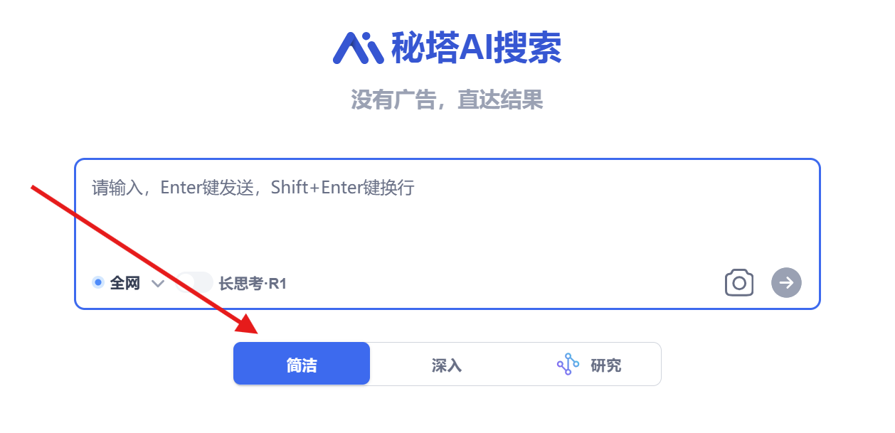
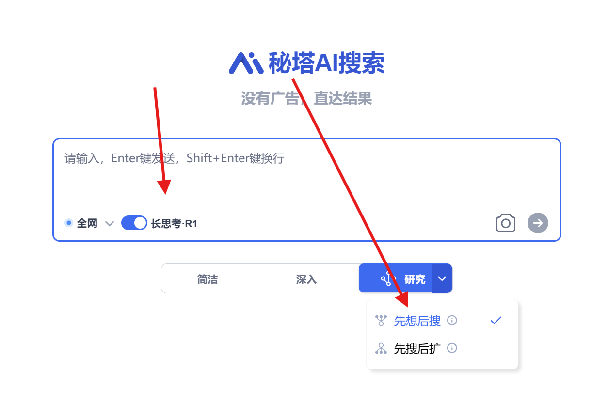
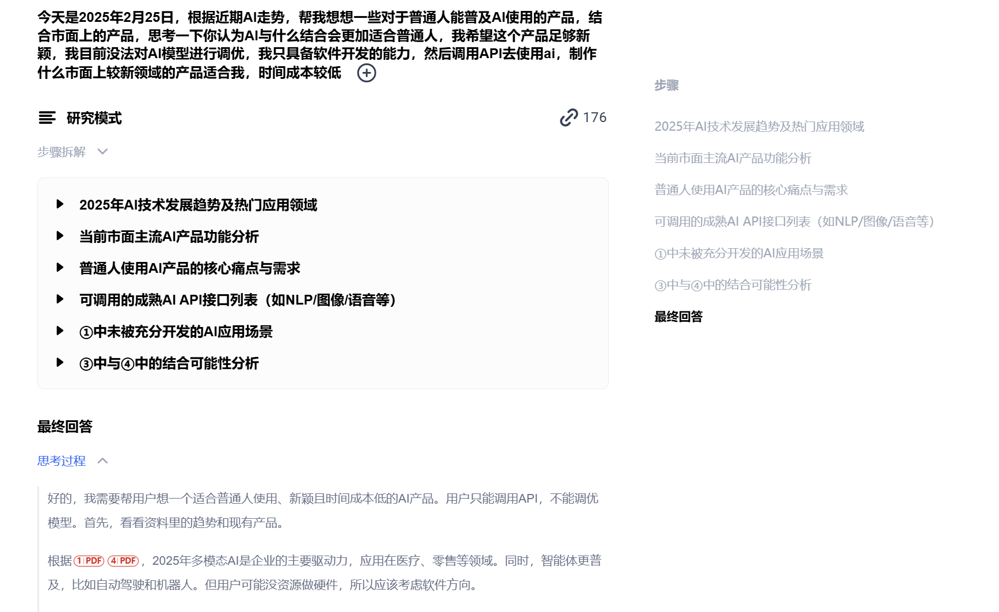
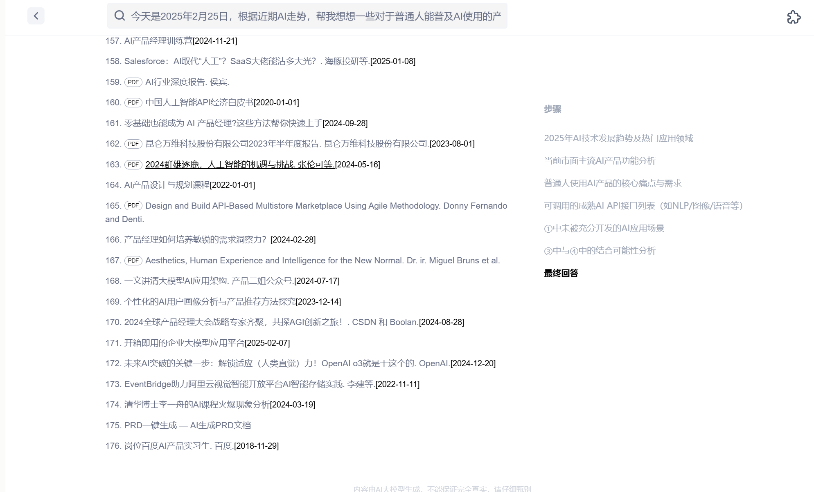
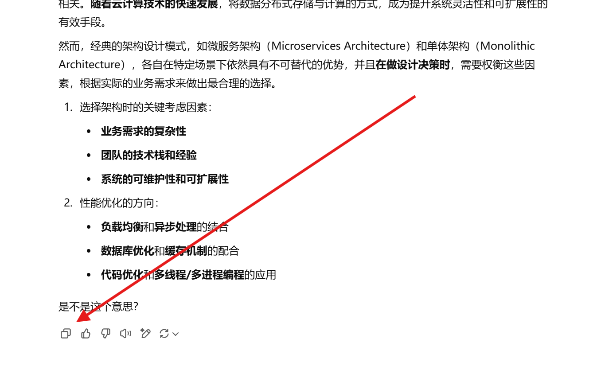
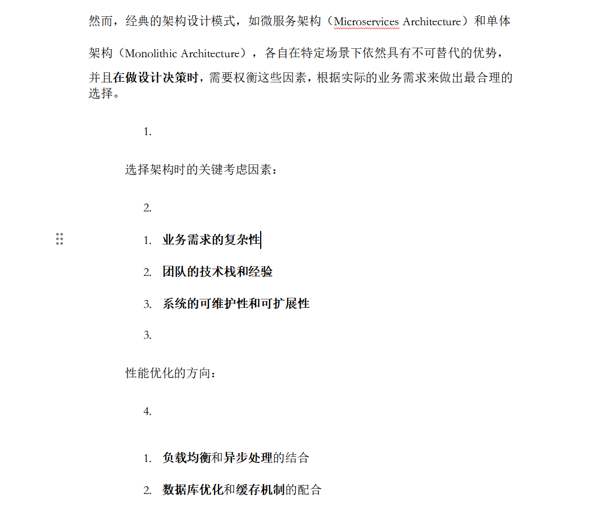
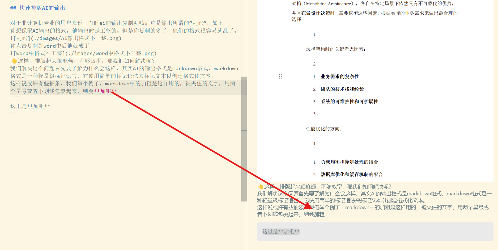
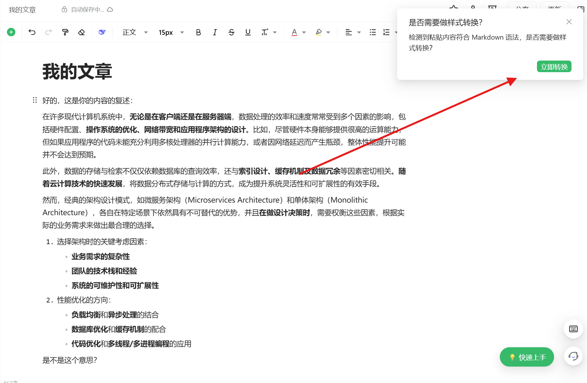
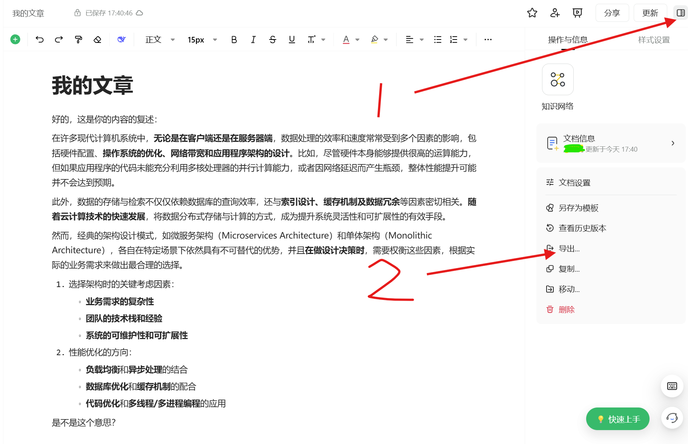

返回[首页](./index.md)

# AI工作流-学习-调研

> 📚 阅读收获
> 
> 通过阅读本文，你将掌握：
> 1. **AI模型选择策略**：了解如何选择适合学习调研的AI模型，特别是在联网搜索和知识整理方面的考量
> 2. **场景化应用方法**：
>    - 掌握简单技术问题的快速查询技巧
>    - 学会复杂问题的深度研究方法
> 3. **效率提升技巧**：
>    - 解决AI输出格式混乱的问题
>    - 掌握从AI输出到Word文档的高效转换方法
> 4. **实用工具运用**：了解语雀等专业写作平台的使用方法，提高文档处理效率
>
> 预计阅读时间：10分钟 ⏱️

## 选择合适的AI模型

在学习和调研工作中,我们需要获取最新的知识。因此,模型是否能联网搜索成为重要的评判指标。目前,由于Deepseek-R1已开源,谁能将其与联网搜索、知识爬取和整理做得最好,谁就是AI学习调研工作流的最佳选择。经过实践,秘塔AI在动态知识库整理方面表现优异,以下将基于秘塔AI展开教程。

## 使用场景及最佳实践

### 简单问题查询
适用场景:
- 需要解决具体的技术问题
- 要求知识库较新
- 对答案准确度要求不是特别高

操作建议:
- 选择"简洁模式"以获得快速响应
- 问题描述要简明扼要

示例:
查询"gitlab-ee如何汉化?"时,如果使用较新版本的gitlab-ee,建议使用简洁模式快速获取最新的汉化方法。[点击查看示例](https://metaso.cn/search/8582550148633821184?q=gitlab-ee%E6%B1%89%E5%8C%96)



### 复杂问题研究
适用场景:
- 产品调研等战略性问题
- 需要最新的市场信息
- 要求答案精确度高

操作建议:
- 使用"研究模式-先想后搜"
- 系统会参考官方文档、专业资料等多个来源
- 提供详实的论据支持

示例效果:




查看完整示例: [点击这里](https://metaso.cn/s/wPcU1BC)

## 🚀 快速排版AI输出

### 常见问题现象
- **格式错乱**：AI输出的Markdown格式复制到Word后排版混乱
- **效率低下**：手动调整格式耗时耗力
- **理解障碍**：非技术人员难以直接处理技术格式

  
▲ AI原始输出与Word粘贴效果对比

### 问题根源
AI输出的Markdown格式使用特殊符号标记排版，例如：
```markdown
**加粗文本** 用双星号包裹
_斜体文本_ 用下划线包裹
# 标题层级
```

  
▲ Markdown语法渲染前后对比

### 解决方案推荐
1. **📚 学习基础Markdown语法**
   - 推荐指数：★★★☆
   - 优势：一劳永逸掌握技术文档处理能力
   - 方法：掌握常用符号即可满足日常需求

2. **🛠️ 使用专业写作平台（以语雀为例）**
   - 推荐指数：★★★★★
   - 优势：零学习成本，自动格式转换
   - 方法：四步快速转换

### 语雀转换四步法
1. **新建文档**  
   
2. **智能转换**  
   粘贴内容后点击"立即转换"
3. **保存文档**  
   按`右上方的更新`快速保存
4. **导出Word**  
   

> 💡 专业提示：建议创建专用知识库管理AI输出内容，方便后续查找和复用
