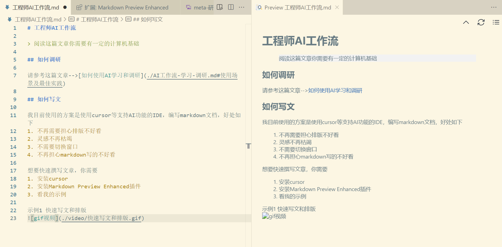
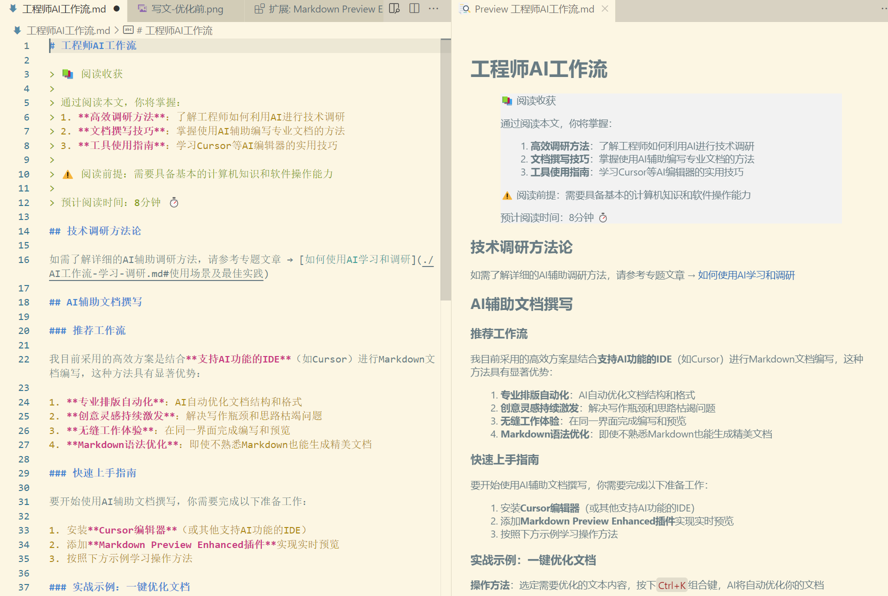
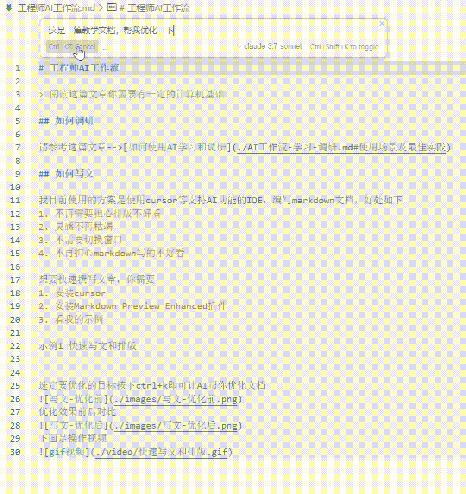

# 工程师AI工作流

> 📚 阅读收获
> 
> 通过阅读本文，你将掌握：
> 1. **高效调研方法**：了解工程师如何利用AI进行技术调研
> 2. **文档撰写技巧**：掌握使用AI辅助编写专业文档的方法
> 3. **工具使用指南**：学习Cursor等AI编辑器的实用技巧
>
> ⚠️ 阅读前提：需要具备基本的计算机知识和软件操作能力
> 
> 预计阅读时间：15分钟 ⏱️

## 技术调研方法论

如需了解详细的AI辅助调研方法，请参考专题文章 → [如何使用AI学习和调研](./AI工作流-学习-调研.md#使用场景及最佳实践)

## AI辅助文档撰写

### 推荐工作流

我目前采用的高效方案是结合**支持AI功能的IDE**（如Cursor）进行Markdown文档编写，这种方法具有显著优势：

1. **专业排版自动化**：AI自动优化文档结构和格式
2. **创意灵感持续激发**：解决写作瓶颈和思路枯竭问题
3. **无缝工作体验**：在同一界面完成编写和预览
4. **Markdown语法优化**：即使不熟悉Markdown也能生成精美文档

### 快速上手指南

要开始使用AI辅助文档撰写，你需要完成以下准备工作：

1. 安装**Cursor编辑器**（或其他支持AI功能的IDE）
2. 添加**Markdown Preview Enhanced插件**实现实时预览
3. 按照下方示例学习操作方法

### 实战示例：一键优化文档

**操作方法**：选定需要优化的文本内容，按下`Ctrl+K`组合键，AI将自动优化你的文档

**效果对比**：

↓ ↓ ↓ 优化后 ↓ ↓ ↓

**操作演示**：
